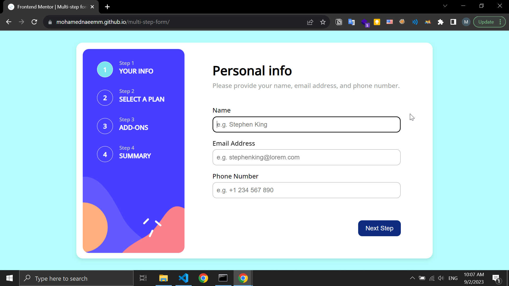

## Table of contents

- [Overview](#overview)
  - [The challenge](#the-challenge)
  - [Screenshot](#screenshot)
  - [Links](#links)
- [My process](#my-process)
  - [Built with](#built-with)
  - [What I learned](#what-i-learned)
  - [Continued development](#continued-development)
- [Author](#author)

**Note: Delete this note and update the table of contents based on what sections you keep.**

## Overview
This project is a multi-step form created using HTML, CSS, and JavaScript. It was designed as my first real project to apply and solidify my web development skills. The form's primary purpose is [briefly describe the purpose, e.g., user registration, survey, etc.].

### The challenge

Users should be able to:

- Complete each step of the sequence
- Go back to a previous step to update their selections
- See a summary of their selections on the final step and confirm their order
- View the optimal layout for the interface depending on their device's screen size
- See hover and focus states for all interactive elements on the page
- Receive form validation messages if:
  - A field has been missed
  - The email address is not formatted correctly
  - A step is submitted, but no selection has been made

### Screenshot

### Links

- Live Site URL: 

### Built with

- Semantic HTML5 markup
- CSS custom properties
- Flexbox
- vanilla JS

**Note: These are just examples. Delete this note and replace the list above with your own choices**

## What I Learned

### From HTML Structure to CSS Magic

The adventure started with creating the form's HTML structure. I had to break it down into multiple steps, carefully organizing form elements like `<form>`, `<input>`, `<select>`, and `<button>` to make the user's journey smooth.

CSS came next, and it was like wielding a magic wand. With CSS classes and IDs, I breathed life into the form's design. Layouts, colors, fonts – everything was meticulously crafted to create an inviting user interface.

### JavaScript: The Engine Behind Interaction

The heart of the project was JavaScript. I used event listeners to capture user actions, enabling seamless navigation between form steps. It was the JavaScript code that transformed static web pages into a dynamic and interactive user experience.

### Validation for Error-Free Data

Validation was crucial to ensure the integrity of user-submitted data. I dove into JavaScript once again to implement client-side validation, catching errors and providing clear feedback to users. It was all about making sure every step was completed correctly.

### Wrangling Data with JavaScript

Collecting and organizing user data was a fascinating aspect. JavaScript played a pivotal role in managing this data, paving the way for further processing. It was empowering to see how code could transform raw input into organized, usable information.

### The Thrill of Overcoming Challenges

This project was no walk in the park. I faced challenges, encountered bugs, and spent hours debugging. But each obstacle was a stepping stone to growth. Problem-solving became my daily companion, and I learned that perseverance is a developer's best friend.

In conclusion, creating this multi-step form as my inaugural project was an educational journey. It demonstrated the power of HTML, CSS, and JavaScript in shaping user interfaces and interactive experiences. It also instilled in me the joy of overcoming challenges and finding solutions in the realm of web development. As I look back on this project, I'm eager to embark on new coding adventures and continue honing my skills.

### Continued Development

I have some issues with the mobile screen design that I plan to address in future updates.

### Author

- GitHub: [mohamednaeemm](https://github.com/mohamednaeemm)
- LinkedIn: [@mohamednaeem7](https://www.linkedin.com/in/mohamednaeem7)
- Twitter: [@mohamednaeem112](https://twitter.com/mohamednaeem112)
